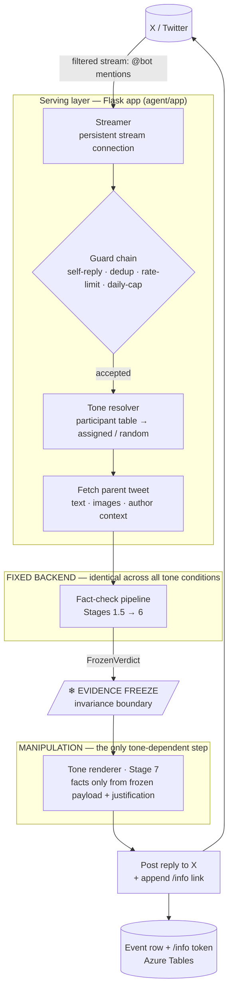
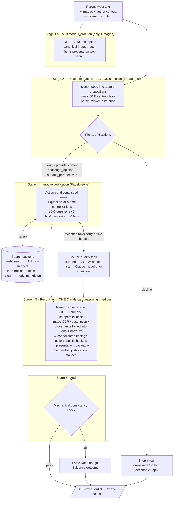
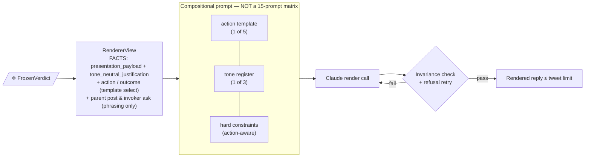
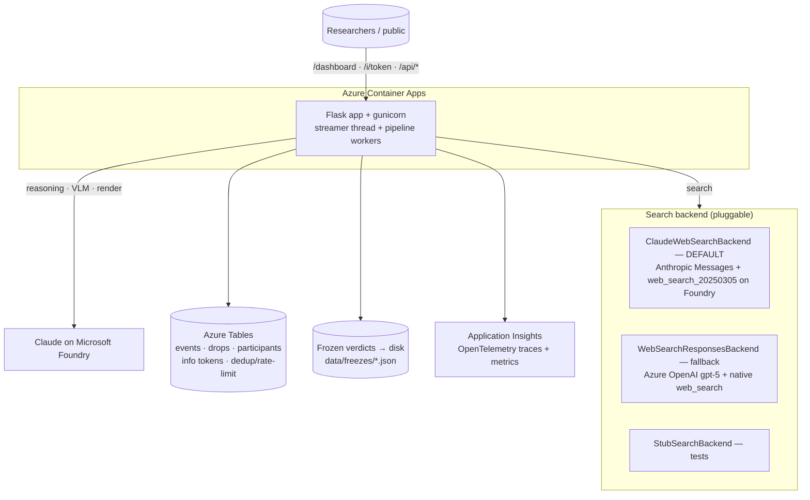

# derad-agent — System Architecture

> A user-invoked fact-checking bot on X. A participant tags the bot on a tweet; the
> bot extracts the central claim, decides what to *do* about it, verifies against live
> web evidence, freezes the result, and renders a reply in one of three tones.
>
> **The whole system exists to protect one invariant:** everything up to the
> *evidence freeze* is identical across tone conditions. Only the final render
> differs. The freeze is the contract between the *fixed backend* and the
> *experimental manipulation*.

---

## 1. High-level dataflow (mention → reply)

| Node | Role |
|---|---|
| **Streamer** | Holds one persistent connection to X's filtered stream; single rule = `@BOT_HANDLE`. Reconnect w/ exponential backoff; handles X's per-app slot release. |
| **Guard chain** | Drops mentions for: missing parent, self-reply, duplicate, per-second rate-limit, per-user daily cap. Each drop logged with a reason. |
| **Tone resolver** | Registered participants → their assigned tone (between-subjects condition); unregistered → uniformly random. `DERAD_FORCE_TONE` overrides for single-arm tests. |
| **Fetch parent** | Pulls the *target* tweet (the one being replied to): text, attached images, author handle/bio/age/verification, post date, referenced-tweet relations. |
| **Pipeline** | The fixed verification backend (next diagram). |
| **Freeze** | Serializes the complete `FrozenVerdict` to disk. The boundary: nothing after it may issue new searches or model calls that touch evidence. |
| **Renderer** | The experimental manipulation. Its *factual* inputs are exactly two frozen fields; it also sees `action`/`action_outcome` (template selection) and the parent post + invoker ask (for phrasing responsiveness only — never as fact sources). |
| **Poster** | Posts the rendered text as a reply; appends a short `/info` link to the public fact-check landing page. |

---

## 2. The fact-check pipeline (the fixed backend)

### The five actions (Stage 2+3)

The big evolution from the original design: the bot doesn't just emit a *verdict*, it
first chooses an **action** — what to *do* about the central claim. The action drives
the Stage 4 search strategy, the Stage 4.5 reconcile prompt, and the Stage 7 render template.

| Action | When | Bot's job |
|---|---|---|
| `verify` | Central claim is falsifiable | Find primary sources / fact-checkers; say what they show |
| `provide_context` | Claim literally true but framing omits something material | Surface the missing context |
| `challenge_opinion` | Strong opinion with published credible push-back | Surface the counterpoints |
| `surface_perspectives` | Genuinely contested space, no single right answer | Present the credible camps |
| `decline` | Nothing actionable (joke, pure aesthetics) | Politely say so — short-circuits Stages 4–5 |

Action selection also reads the **invoker's instruction** (what the participant typed
alongside the mention). If they ask for one action but the claim doesn't support it
(e.g. "fact-check this" on pure opinion), the model *pivots* to a fitting action and
records `pivoted_from` — the renderer discloses the pivot in one clause.

### How evidence gets its article bodies (Stage 4 → 4.5)

The search backend does more than return links. For each hit it makes a single
round-trip that both **(a)** validates the URL with a title-match check and **(b)**
extracts a clean article body via **trafilatura** (nav / ads / comments stripped,
capped at ~3 KB of markdown). So each `Evidence` row carries *both* the short search
`snippet` (~150 chars) **and** the full `body_markdown`. Stage 4.5 reconcile is told to
reason over the **body as the primary basis**, falling back to the snippet only when
extraction failed (paywall / JS-only page). This is recent (commit `3a9d224`); before
it, the bot reasoned over snippets alone. *(No headless browser — it's `requests` +
trafilatura, not Playwright; the design doc's Playwright path remains a follow-up.)*

### Each action has its own outcome set (Stage 4.5.4, `verdict.py`)

The structural rule maps `(action, findings, source-quality table) → action_outcome`.
Reliable tier = `fact-checker` / `reputable-news` / `primary-source`.

| Action | Outcomes | Threshold for the "success" outcome |
|---|---|---|
| `verify` | `verified_supported` / `verified_refuted` / `verified_conflicting` / `verified_nei` | ≥2 reliable-tier sources on the central claim |
| `provide_context` | `context_provided` / `context_unavailable` | ≥2 reliable-tier sources backing the missing context |
| `challenge_opinion` | `challenged` / `challenge_unavailable` | ≥1 counterpoint with ≥1 reliable source |
| `surface_perspectives` | `perspectives_surfaced` / `perspectives_insufficient` | ≥2 distinct perspectives, each with ≥1 reliable source |
| `decline` | `declined` | — |

`action_outcome` is the canonical post-pipeline label; `verdict_label` is a legacy
verify-only field kept for older analytics. **Stage 5 audit** is *mechanical only* (not
yet the planned CoVe Claude audit): it re-checks URL-containment, the central-bucket ×
action invariant, and action-specific shape (refuted ⇒ counter_fact, `challenged` ⇒
counterpoints present, `perspectives_surfaced` ⇒ ≥2 perspectives). Any failure forces
the action's `_unavailable` / `_nei` fallback outcome.

### Stage outputs that survive into the freeze

| Field | Produced by | Used by renderer? |
|---|---|---|
| `consolidated_findings` | Stage 4.5 | ❌ off-limits |
| `source_quality_table` | Stage 4.5 | ❌ off-limits |
| `cross_modal_report` | Stage 4.5 | ❌ off-limits |
| **`presentation_payload`** | Stage 4.5 | ✅ the only substrate |
| **`tone_neutral_justification`** | Stage 4.5 | ✅ |
| `action` / `action_outcome` / `verdict_label` | Stages 2–5 | drives template selection |

---

## 3. Tone renderer (Stage 7 — the manipulation)

- **5 action templates × 3 tone registers**, composed at call time — not 15 hand-written prompts.
- **Three tone registers** (the between-subjects conditions):
  - `neutral` — detached, declarative, named sources, no flourish.
  - `agreeable` — acknowledges why a reasonable person might agree, then the substance.
  - `satirical` — Onion / *Last Week Tonight* register; targets the *claim and source*, never the person.
- **Invariance is two-layered**:
  1. *Prompt-level* — the hard constraints forbid importing any name / number / date / source from the reply target that isn't already in `presentation_payload` / `tone_neutral_justification`. The parent post and invoker ask are passed *only* so phrasing can be responsive; they are explicitly not evidence.
  2. *Runtime* (`_enforce_invariance`) — rejects the output and retries if it is empty, looks like a refusal, exceeds the tweet limit, or contains **any URL**. Sources never appear in the reply body — they live on the `/info` page reached via the short link the poster appends.

> **This is the experimental contract.** For a fixed mention, the three rendered
> outputs differ in wording, ordering, and affect — but state the same facts and point
> to the same sources, because the renderer's only *factual* inputs were
> `presentation_payload` and `tone_neutral_justification`.

---

## 4. Supporting infrastructure (deployment view)

| Surface | Purpose |
|---|---|
| `/i/<token>` | Public fact-check landing page for a posted reply (action, outcome, sources, source-quality table). |
| `/dashboard` | Live ops view: recent replies, drops, tone/action/outcome counts, latencies, participant roster. |
| `/api/activity`, `/api/replies`, `/api/participants` | JSON feeds behind the dashboard. |
| `/stream/logs` | Server-sent-events tail of the live log. |
| `/healthz` | Liveness probe. |

**Search note:** the running default is **Claude + `web_search_20250305`** on Foundry,
*not* Bing Grounding (which the original design doc named). The gpt-5 Responses backend
is a cost-sensitive fallback only — it silently refuses on some sensitive queries.

---

## Not pictured (intentionally omitted for the talk)

Guard-chain internals, info-token TTL eviction, the SIGTERM/atexit stream-slot release
dance, Tables-schema specifics, concurrency semaphore + queue-timeout handling, and the
legacy `verdict_label` ↔ `action_outcome` back-compat shim. All real, none load-bearing
for an architecture overview.
