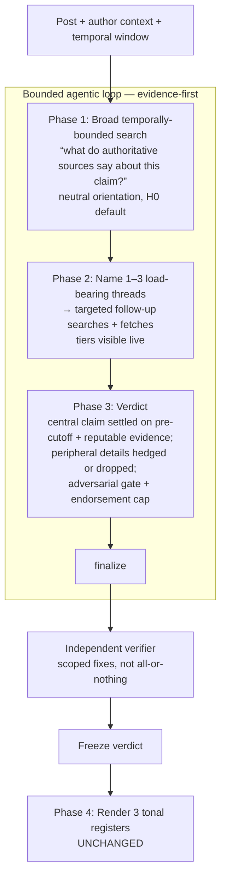

# Fact-check v0.8 — Evidence-First Loop (Design Spec)

**Date:** 2026-07-16
**Status:** Draft for review
**Supersedes:** the v0.7 playbook/verifier flow (loop engine core is retained and evolved, not replaced)

## Goal

Stop the loop engine from shipping "not enough evidence" when a defensible conclusion
exists, by replacing hypothesis-first targeting with an **evidence-first flow** (broad
temporally-bounded search → deepen a few threads → verdict), separating the **central
claim** from **peripheral details** so a shaky side-fact can't sink a correct verdict, and
wiring the **reputable-source list** into the loop's live decisions and provenance.

## Motivation

### The triggering failure (grounded)

Post: *"Illegal immigrants killed 13,000 Americans in 2024 … 64% of all murders."* A
Community Note refutes it (the 13,099 figure is ICE's cumulative multi-decade list of
noncitizens with prior homicide convictions, which DHS called "misinterpreted").

The agent **reached the same correct conclusion** — its `verdict_derivation` nails the
category error, and all 7 evidence rows refute the post — but it **shipped
`verified_nei`** with generic "could not be verified" boilerplate. Cause:

1. The independent verifier found **one corroborating source published after the cutoff**
   (a think-tank article) and a **mismatch in a peripheral number** (the exact 2024 US
   homicide total, on which low-quality sources disagreed: 15,795 vs 16,935).
2. The verifier's response is **all-or-nothing**: it downgraded confidence and the
   temporal-scrub replaced the strong central refutation with NEI boilerplate.

So the NEI was a **false negative from the machinery**, not a real evidence gap. The
central claim was decisively refuted by pre-cutoff fact-checker + FBI sources; only a
peripheral number and a secondary corroborator were shaky.

### Secondary findings

- **Hypothesis-first targeting was not the culprit here** (it correctly found the category
  error), but the bot's job is to assess a claim a user hands it — an evidence-first flow
  ("what do authoritative sources say about this?") is a more natural fit and avoids
  pre-committing to "ways this could mislead."
- **The reputable-source list already exists** (`agent/factcheck/data/source_lists.json`:
  IFCN fact-checkers + Wikipedia RSP + editorial supplement; lookup in
  `agent/factcheck/sources.py`) but is only applied **post-hoc at freeze time** to label
  the `source_quality_table`. The drafting agent never sees tiers while deciding, so in the
  failing case it anchored a load-bearing number on Statista/Substack instead of the
  FBI/fact-checker sources it already had. The list also has coverage gaps (grokipedia,
  substacks → "unknown").

## Non-Goals

- Not changing the **freeze → render** boundary or the **three tonal registers**.
- Not changing the **temporal contract** semantics (`as_of` = post time; cutoff = +48h).
- Not touching the **legacy staged pipeline** (its deletion is a separate deferred item).
- Not building bias **measurement** apparatus (prior scope call) — the bias *guards* stay.
- Not re-running the full 108-post study set here; this spec ends at a validated engine.

## Architecture — the four-phase flow



The loop tools (`web_search`, `fetch_page`, `finalize`), the freeze/render boundary, and
the verifier-as-separate-pass structure are all retained from v0.7. What changes is the
*playbook* driving the loop, the *verdict schema's* central/peripheral split, the
*verifier's* remediation granularity, and the *tier signal* being exposed live.

## Components

### C1 — Search flow: orient → deepen (replaces hypothesis enumeration)

**Responsibility:** drive the loop from a broad, unbiased sweep to a focused deepening,
without pre-committing to a list of ways the post might mislead.

**Changes**
- Rewrite `agent/factcheck/prompts/loop_playbook.md` §2–§4:
  - **Phase 1 — orient:** a broad, temporally-bounded sweep framed as *establish what
    authoritative sources say about this claim* (the official record, primary data,
    fact-checker coverage). Explicitly **not** "enumerate how this misleads."
  - **Phase 2 — deepen:** from what Phase 1 returns, name the **1–3 load-bearing threads**
    that actually decide the verdict, and run targeted follow-up searches + fetches on
    those. This is where any "could this be a fabricated quote / cherry-picked window /
    category error?" reasoning happens — as *lenses applied to what was found*, not as the
    opening move.
  - **Phase 3 — verdict:** synthesize from the strongest evidence.
- **Bias controls preserved without the hypothesis list:**
  - Neutral orientation ("find the facts," not "find the lie").
  - **H0 default** — assume accurate and fairly framed until evidence positively displaces
    it (unchanged).
  - **Adversarial gate** — before finalizing, search the strongest case *against* the
    current lean (unchanged).
  - **Endorsement cap** — a literally-true-but-misframed post is `provide_context`, never
    `supported` (unchanged).
- `DraftVerdict` (`agent/factcheck/draft.py`): retire `hypotheses: list[str]` and
  `target_hypothesis: str` as required inputs. Replace with a single optional
  `central_question: str` ("the question the verdict answers"). `central_claim` stays.
  - Downstream readers to update: `assemble_frozen` (populates `hypotheses`,
    `target_hypothesis` on the frozen record and in `cross_modal_report`), the freeze
    schema, and the artifact/consumers that read those fields. The frozen record keeps a
    `central_question` field for traceability in place of the hypotheses block.

**Trade-off:** a broad search risks being less focused than targeted hypotheses →
mitigated by the mandatory "name 1–3 threads, then deepen" structure and the existing turn
budget.

### C2 — Verdict granularity: central vs peripheral (the NEI fix)

**Responsibility:** ensure a correct verdict on the **central** claim ships even when a
**peripheral** supporting detail is uncertain or unverifiable.

**Changes**
- `DraftVerdict`: make the central/peripheral split explicit.
  - `load_bearing_facts` are redefined as **central facts** — the facts the verdict stands
    on; each must trace to a **pre-cutoff, reputable** source (enforced in C3/C4).
  - Add `peripheral_facts: list[str]` (default empty) — supporting or color details that
    may be **hedged or dropped** without changing the verdict.
  - `verdict_leaning` and `headline_finding` bind to the **central claim**.
- `derive_action_outcome` / `reconcile_outcome_with_finding`
  (`agent/factcheck/verdict.py`): a peripheral-fact gap must **not** force a no-result
  label. `verified_nei` / `context_unavailable` are reserved for when the **central** claim
  cannot be settled from pre-cutoff evidence.

**Applied to the trigger case:** central claim ("13,000 killed / 64% of murders") is
refuted on pre-cutoff FBI + fact-checker sources → ships `verified_refuted`; the contested
exact-homicide-total is a peripheral fact → dropped from the reply. No NEI.

### C3 — Verifier recalibration: scoped fixes, not all-or-nothing

**Responsibility:** remediate specific defects without discarding a well-supported verdict.

**Changes** (`agent/factcheck/verifier.py`, `verify_draft` + `run_verified_loop`)
- Classify each finding as **central** or **peripheral**:
  - *Peripheral* defect (a post-cutoff **corroborating** source; a bad/uncorroborated
    peripheral number; a low-tier citation for a peripheral fact) → **scoped drop**: remove
    that one item and **keep the verdict**, provided the central claim still stands on
    adequate pre-cutoff, reputable evidence.
  - *Central* defect (the central assertion lacks pre-cutoff reputable support; a
    fabrication-language violation; an injection) → revision round, then downgrade, as
    today.
- **Temporal scrub narrows:** the payload-neutralizing scrub fires only when a **central,
  load-bearing** fact is post-cutoff — not when a secondary corroborator is.
- `VerifierReport` (`agent/factcheck/schema.py`): add `scoped_drops: tuple[str, ...]`
  recording what was removed, for freeze transparency. `passed` now means "central claim
  stands" (possibly after scoped drops); `downgrade` remains for central failures.

### C4 — Reputable-source list: wired into the loop + expanded

**Responsibility:** let the agent prefer reputable sources **while deciding**, enforce it
at verdict time, and maintain provenance by construction.

**Changes**
- `agent/factcheck/loop_tools.py`:
  - `fetch_page` result block gains a `tier:` line — e.g.
    `tier: reputable-news (wikipedia-rsp)` — from `sources.classify(domain)`, alongside the
    existing `published_date`. The agent sees reputability live.
  - `record_search_results` annotates each result row with its tier so Phase-1 triage can
    prefer reputable hits before fetching.
- **Verifier enforcement (C3):** every **central** `load_bearing_fact` must trace to a
  reputable tier (`fact-checker` / `reputable-news` / `primary-source`); otherwise require
  a better source or a hedge. This is the concrete meaning of "most sources reputable."
- **List expansion:** extend `agent/factcheck/data/source_lists.json` editorial supplement
  to cover the gap domains observed (aggregators, common substacks, wiki-style sites) with
  correct tiers; regenerate IFCN/RSP via `scripts/refresh_source_lists.py`. Coverage
  expansion is incremental and does not block the flow changes.
- **Provenance:** maintained by construction — every reply fact resolves to a fetched,
  tier-known, pre-cutoff source captured in the freeze's `source_quality_table` +
  `evidence` rows (already recorded; now the tier is decision-time, not post-hoc).

### C5 — Unchanged (explicit)

Freeze → render boundary; the three tonal registers and `render_all_tones` lints (R-4/R-5);
the temporal contract; the debiasing guards (H0, adversarial gate, endorsement cap);
prompt-store versioning (hash rolls into every freeze); decontamination (no study-derived
examples in prompts).

## Data flow

```
post + tweet_context + (as_of, cutoff)
  → Phase 1  web_search × broad, tier-annotated results
  → Phase 2  fetch_page × threads (body + published_date + TIER)
  → finalize DraftVerdict{ central_claim, headline_finding, verdict_leaning,
                           load_bearing_facts (central, reputable+pre-cutoff),
                           peripheral_facts (droppable), evidence_refs, derivation }
  → verify_draft → scoped drops | revision | downgrade   (central vs peripheral)
  → assemble_frozen (source_quality_table, central_question, verifier_report{scoped_drops})
  → freeze_to_disk
  → render_all_tones → {neutral, satirical, agreeable}
```

## Error handling

- Loop never finalizes within budget → honest NEI record (existing behavior).
- **Central** claim genuinely unsettleable from pre-cutoff evidence → `verified_nei` — the
  *correct* use of NEI.
- Peripheral gap → scoped drop, verdict ships (C2/C3).
- Post-cutoff **central** fact → temporal scrub (existing, now narrowed to central facts).
- Fabrication-language / injection → central defect → revision/downgrade (unchanged).

## Testing & validation

**Unit tests**
- Verdict granularity: a peripheral-fact gap yields the decisive central outcome, not NEI.
- Verifier scoped-fix: a post-cutoff corroborator on a peripheral fact → dropped, verdict
  retained; a post-cutoff central fact → scrub. Central-unsupported → downgrade.
- `fetch_page` tier annotation present and correct for known domains; unknown domains
  labelled `unknown` without error.
- Source enforcement: a central fact backed only by low-quality/unknown tiers triggers a
  hedge/revision.

**Regression (must still hold)**
- 3-post balance regression (`.claude/debias_regression.py`): cherry-pick → context,
  fabrication → refuted, accurate → supported.

**Re-validation before v0.8 becomes the study generator**
- Replay on the decontaminated held-out set (15 posts, seed 42) + re-run the 10-post
  explorer. **Acceptance bar:**
  - Accuracy vs Community Notes **≥ v0.7** (keep the high scores).
  - **NEI rate drops** on posts where a Community Note reached a conclusion; specifically,
    the "13,000 killed" case ships a refutation, not NEI.
  - 0 post-cutoff **central** citations; endorsement cap holds; balance regression clean.

## Rollout

- v0.8 ships under the existing `DERAD_FACTCHECK_ENGINE=loop` path (this is the loop engine
  evolved, not a new engine). `prompt_version` rolls automatically into freezes.
- v0.7 remains recoverable via git history; no destructive changes to the staged pipeline.
- Only after the acceptance bar is met do we regenerate study stimuli with v0.8.

## Risks & mitigations

| Risk | Mitigation |
|------|------------|
| Looser search without hypotheses misses the key thread | Mandatory "name 1–3 threads, then deepen" structure + turn budget |
| Central/peripheral misclassification ships a confident but wrong verdict | Verifier enforces central facts are pre-cutoff **and** reputable; adversarial gate retained; peripheral must be hedged/dropped, never asserted |
| Big prompt change drifts behavior | Full re-validation on held-out set before v0.8 generates stimuli; balance regression gate |
| Tier signal makes the agent over-trust "reputable" and under-read primaries | Tier is a preference signal, not a filter; primary-source data still fetched and read |

## Open questions (for the plan stage, not blocking)

- Exact `peripheral_facts` schema shape vs. a per-fact criticality flag — pick the
  lower-churn option during planning.
- Whether `central_question` fully replaces `target_hypothesis` in the frozen record or is
  added alongside for backward-compatible freeze reads.
