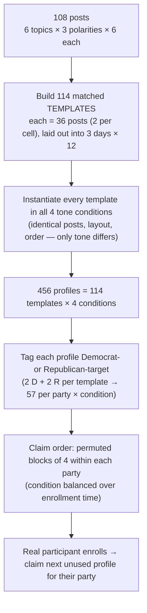

# Study 2 — Participant Allocation: Logic & Rationale

*How 456 participants are assigned to conditions and posts, and why every choice was made. Written for the research team; doubles as the Methods backbone.*

Companion files: design spec (`docs/superpowers/specs/2026-07-16-participant-profiles-design.md`), power analysis (`study/docs/power-analysis-2026-07-16.md`), the generated allocation (`study/data/profiles/`).

---

## 1. TL;DR

We pre-generate the **entire allocation before recruitment** as a fixed pool of **456 participant profiles**. A profile is one participant's complete assignment: their tone condition, their target party, and the exact 36 posts they'll see, split across 3 days. When a real participant enrolls, we don't compute anything — we hand them the next unused profile. The whole pool is generated deterministically from a fixed random seed, so it is auditable and reproducible before a single person is recruited.

| | |
|---|---|
| **Design** | Between-subjects, 2 (party) × 4 (tone) factorial |
| **Tone conditions** | neutral · agreeable · satirical · Community-Notes control |
| **N** | 456 (114 per tone arm; 57 per party × tone cell; 228 Democrats + 228 Republicans) |
| **Stimulus pool** | 108 Community-Notes-flagged posts (6 topics × 3 polarities × 6 posts) |
| **Per participant** | 36 posts (2 per topic × polarity cell), 12/day × 3 days |
| **Key property** | Post content is **matched** across the four tone arms — only tone varies |
| **Reproducibility** | Single fixed seed (20260716); regenerates bit-identically |

---

## 2. The design in one picture

The logic runs top to bottom: content first (templates), then the tone manipulation (cross with 4 conditions), then the participant-side factor (party), then the randomized order in which humans receive profiles.

---

## 3. What we're allocating

Three things vary, and they are deliberately kept orthogonal:

- **Tone (the manipulation, between-subjects):** neutral, agreeable, satirical, or the Community-Notes control. Each participant sees *one* tone for all 36 of their posts. The fact-check backend (claim, evidence, verdict) is identical across tones — only the reply's register changes.
- **Post content (the stimuli):** which 36 of the 108 posts a participant sees, balanced across the 6 topics (LGBT, immigration, healthcare, cost of living, religion, race) and 3 viewpoint polarities (left / center / right).
- **Party (a participant attribute, crossed blocking factor):** Democrat or Republican, established by a Prolific prescreen. Party governs *which* profile a participant can claim but is independent of the post content.

---

## 4. The allocation algorithm

Five deterministic steps, all driven by one seeded random generator.

**Step 1 — Build 114 matched templates.** For each of the 18 `(topic × polarity)` cells (6 posts each), pick **2 of the 6** posts using least-used selection across templates. Because 114 × 2 / 6 = **38 exactly**, every post ends up in exactly 38 templates — perfectly even, no rounding drift. Each template is a balanced 36-post set (2 per cell → 6 per topic, 12 per polarity).

**Step 2 — Lay out each template into days.** Split the 36 posts into 3 days of 12, with each day balanced across polarity (4 left / 4 center / 4 right) and topics spread (≤ 2 of any topic per day). Within-day order is fixed per template.

**Step 3 — Cross with the four tone conditions.** Instantiate each template in all four conditions with *identical posts, day layout, and order* — only the tone of the fact-check reply differs. This yields **456 profiles = 114 × 4**, exactly 114 per condition. Because the post-set is held fixed across the tone arms, differences between conditions cannot be attributed to which posts a participant happened to see.

**Step 4 — Assign party targets.** Label each profile Democrat- or Republican-target so that (a) each template is targeted to 2 Democrats and 2 Republicans across its four conditions, and (b) within each condition, 57 templates go to each party. Result: **57 participants per party × condition cell**, and party is orthogonal to both template and condition.

**Step 5 — Set the claim order.** Within each party's 228 profiles, order them in **permuted blocks of four** — every consecutive block of 4 contains one profile of each condition, shuffled. This keeps condition balanced at every point during enrollment, so the *order people sign up* can't correlate with *which condition they land in*.

Enrollment then reduces to: participant arrives → we read their prescreened party → claim the next unused profile in that party's order → bind it to their ID.

---

## 5. Balance guarantees (verified from the generated pool)

These are not approximate — they were recomputed directly from the committed artifact and every one holds exactly:

| Level | Guarantee |
|---|---|
| Within participant | 36 posts; 6 per topic, 12 per polarity; each day 4/4/4 by polarity |
| Within each tone condition | every post shown **exactly 38×**; all 108 posts covered |
| Across tone conditions | post-sets **identical** (matched); each post 38× in *every* condition, 152× total |
| Tone conditions | exactly **114** participants each |
| Party × condition | exactly **57** per cell; all 8 cells present (228 D + 228 R) |
| Party × template | 2 Democrats + 2 Republicans per template |

Total post-exposures: 456 × 36 = 16,416 = 108 posts × 152.

---

## 6. Why these choices

Each decision below was made deliberately; several reversed an earlier, weaker plan.

### Matched post-sets across conditions
The study isolates a *message feature* (tone). Holding the stimulus set fixed across conditions and varying only the manipulation is the standard way to prevent stimulus selection from confounding the effect (Judd, Westfall & Kenny, 2012; Clark, 1973). We chose this over drawing each profile's posts independently, which would have leaked post-selection variance into the tone comparison.

### Party as a crossed factor, via a Prolific prescreen
Participant party is the strongest driver of affective polarization, so leaving it to chance across arms is a needless risk. Prescreening on Prolific lets us make it a balanced, crossed blocking factor (25%… i.e. 57 per cell), which also enables testing whether Democrats and Republicans respond to satire differently. A side benefit: it turns the binary Democrat/Republican framing into an explicit, stated **inclusion criterion** rather than an accidental exclusion of independents.

### Randomized claim order — a fixed seed is *not* randomization
This one is subtle and easy to get wrong. The seed fixes the *pool*; it does **not** decide which human gets which profile. If profiles were claimed in a naive fixed order, condition could become correlated with enrollment time (early Prolific responders differ systematically from late ones). Permuted-block randomization on condition — the standard RCT technique — keeps the arms balanced throughout recruitment and conceals the next assignment. Allocation is further concealed by opaque per-link codes, so neither participant nor experimenter can read the condition off a URL.

### Analysis follows the design
The matched, crossed structure only pays off if the analysis models it. Preregistered plan:
- **Engagement (RQ1)** — a mixed model with crossed random effects for participants *and* posts (`rating ~ condition * party + (1|participant) + (1|post)`), required to generalize over the population of posts.
- **De-antagonizing (RQ2)** — ANCOVA on the pre/post affective-polarization change with the baseline as covariate, split into *antagonistic* and *agonistic* subscales.

### Dose = 36 posts, delivered over 3 days
Two levers here, and they behave differently:

- **Days (3, not 6):** with the total dose fixed, the number of days does **not** affect statistical power — it's a delivery choice. Fewer days means less attrition (each day is a dropout point) and a narrower window in which real-world political news can contaminate the polarization measure. So 3 days is cheaper *and* cleaner. The only thing we give up is the ability to study whether satire's appeal fades with repetition ("humor fatigue"), which we judged non-essential.
- **Dose (36, not 54):** engagement power is essentially flat in dose (the tone contrast is between-subjects, so it's driven by participant count, not posts-per-person). The only reason to carry a larger dose would be to hedge the polarization effect — but that rests on an assumed dose–response relationship we *cannot even estimate* with a single dose level, and 36 tone-consistent fact-checks over 3 days is already a substantial intervention. A positive result at 36 is the more scalable claim; a null is dose-limited either way. So the extra posts weren't worth ~$2k and a longer study.

### N = 456 (from the power analysis)
Sized so that **RQ2 (polarization change) is a confirmatory endpoint**: 114 per arm gives 80% power to detect a small-to-moderate effect (d = 0.30) via ANCOVA (assuming a pre/post correlation of ~0.6). At this N, RQ1 engagement is very well powered (≥ 0.94 even for its weakest contrast) and party × tone interactions reach ~0.91 for a medium effect. Effect-size anchors came from the Study-1 pilot (mixed models on ~300 ratings) rather than pure convention. Documented upgrade paths: ~608 for multiple-comparison protection or 90% power; ~1,016 to power a truly-small d = 0.20.

---

## 7. What this does *not* fix (state it plainly)

A strong allocation removes some confounds and leaves others that live outside it. These belong in the limitations section:

1. **Differential attrition by condition** — the main residual internal-validity threat over a multi-day study. If satirical retains participants better, the completers differ by arm. Mitigation: monitor attrition by arm and run a completion-based sensitivity analysis. Larger N does not remove this; 3 days reduces but doesn't eliminate it.
2. **The control arm is a bundle** — Community Notes differs from the bot arms on source, format, *and* persona simultaneously, so "AI vs. crowd" is a multi-dimensional contrast, not a clean single factor.
3. **Stimulus scope** — every post is Community-Notes-flagged as misleading, so results generalize to that population, not political posts at large; the bot's false-positive rate is structurally unmeasured.
4. **Dose is a single level** — we cannot make any claim about how the effect scales with exposure; a null on polarization is dose-limited.
5. **Ecological validity** — a paid mock-interface rating task is not organic social-media engagement.
6. **Self-reported party** — Prolific prescreen vs. the in-survey item; mitigated by cross-checking the two and excluding mismatches.

---

## 8. How it runs in practice

- **Recruitment:** two Prolific studies, prescreen-filtered to Democrats and Republicans; each entry link carries the party tag. Because it's a 3-day longitudinal study, we over-recruit above 228 per party to net 228 completers.
- **Assignment:** on a participant's first session, the interface reads their party and atomically claims the next unused profile from that party's permuted-block order, binding participant → profile.
- **Delivery:** each day the participant sees their 12 posts for that day (server returns opaque codes; condition never appears in anything the browser can read). Ratings are collected in the survey; condition is joined back offline by participant ID.
- **Attrition:** a profile whose participant drops out or is rejected is released back to its party's pool for re-claim, preserving the target of 228 completers per party.

---

## 9. Reproducibility & artifacts

The entire pool is a pure function of the stimulus set plus one integer seed (20260716). Anyone can regenerate it and get byte-identical output. Committed under `study/data/profiles/`:

- **`profiles.json`** — canonical: every profile's condition, party target, day-by-day posts, and access codes.
- **`profiles.csv`** — one row per profile-post (16,416 rows) for analysis and human review.
- **`profiles_report.md`** — the balance verification (all checks pass) that gates release.

Because the allocation is fixed and inspectable before recruitment, the team can review and sign off on exactly what every participant will experience — and the paper can report the allocation strategy precisely, with the seed, as a reproducible artifact.

---

### Appendix — the numbers at a glance

| Quantity | Value |
|---|---|
| Participants | 456 |
| Tone conditions | 4 (neutral, agreeable, satirical, Community-Notes control) |
| Per tone arm | 114 |
| Party split | 228 Democrats / 228 Republicans |
| Per party × condition cell | 57 |
| Stimulus pool | 108 posts (6 topics × 3 polarities × 6) |
| Posts per participant | 36 (2 per topic × polarity cell) |
| Schedule | 12 posts/day × 3 days |
| Matched templates | 114 |
| Post exposures per condition | 38× each |
| Total post-exposures | 16,416 |
| Randomization | permuted blocks of 4 (condition) within party |
| RNG seed | 20260716 |
| Power target | RQ2 confirmatory: d = 0.30, 80%, ANCOVA |
| Est. Prolific cost | ~$6.4k (recommended rate + attrition buffer) |

---

## Addendum (2026-07-22): fielded pool enlarged to 600 for attrition headroom

The study fields a **600-profile pool** (150 templates × 4 conditions, seed **20260722**)
instead of the original 456: 300 Democrat + 300 Republican starters, exactly **75 per
party × condition cell**, every post seen exactly **50× per condition** (200× total).
All §5 guarantees hold identically (verifier report committed). Rationale: start all
recruits as one same-calendar cohort rather than attrition-replacement waves; at the
expected ~76% three-day retention, ~456 completers ≈ the power-analysis N. Final cell
sizes float with attrition; analysis uses mixed-effects models (crossed random effects
for participant and post), which do not require balanced cells. Differential attrition
by condition is monitored and reported (rates by arm + baseline-covariate dropout tests).
